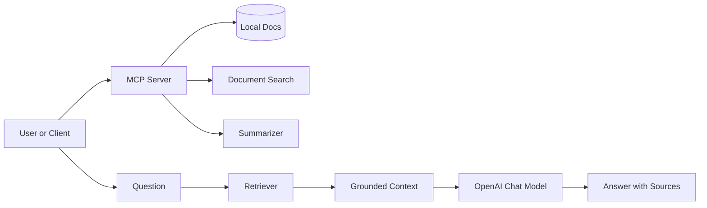

# MCP Demo

This project demonstrates a small Model Context Protocol style workflow in Python. It exposes:

- a document lookup tool
- a summary tool
- a reusable document store
- a local OpenAI-backed answer step for grounded responses

## Setup

```powershell
cd C:\Projects\MCP
python -m venv .venv
.\.venv\Scripts\Activate.ps1
pip install -r requirements.txt
pip install -r requirements-dev.txt
Copy-Item .env.example .env
```

Set `OPENAI_API_KEY` in your environment or `.env`.

## Run

```powershell
python app.py
```

The demo starts a local MCP server on stdin/stdout for tool use by default and also provides a CLI mode for quick testing.

To run the HTTP transport instead:

```powershell
python app.py --transport streamable-http
```

## Architecture



## Project Structure

- `app.py`: MCP server and CLI entry point
- `docs/`: local source material
- `tests/`: unit tests for non-network logic
- `requirements.txt`: runtime dependencies
- `requirements-dev.txt`: test dependencies
- `.env.example`: required environment variables

## Transport Modes

- `stdio`: default and best for local agent connections
- `streamable-http`: useful when a client connects over HTTP
- `sse`: available for compatibility with older MCP clients

## Security

Do not commit `.env`, logs, caches, or API keys. This project uses the same `OPENAI_API_KEY` environment variable as the earlier AI projects.

## Testing

```powershell
python -m pytest
```
