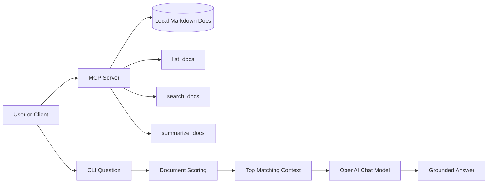

# LangChain MCP Demo

This repository demonstrates a small Model Context Protocol style workflow in Python.

It shows how to:

- expose reusable tools through MCP
- keep a local document corpus in the repo
- retrieve grounded context from those documents
- generate a short OpenAI-backed answer from the retrieved context
- run the same project as a CLI for quick checks

## What’s Inside

- MCP tools for listing, searching, and summarizing local documents
- a CLI mode for quick smoke testing
- a small local knowledge base in `docs/`
- a test suite for non-network logic
- project docs that cover architecture, configuration, testing, and security

## Setup

```powershell
cd C:\Projects\MCP
python -m venv .venv
.\.venv\Scripts\Activate.ps1
pip install -r requirements.txt
pip install -r requirements-dev.txt
Copy-Item .env.example .env
```

Set `OPENAI_API_KEY` in your environment or `.env`.

## Run

```powershell
python app.py
```

The demo starts a local MCP server on stdin/stdout for tool use by default and also provides a CLI mode for quick testing.

To run the HTTP transport instead:

```powershell
python app.py --transport streamable-http
```

## Architecture



### Request Flow

1. A client or CLI user asks a question.
2. The project loads the local documents from `docs/`.
3. The document scorer ranks the best matches.
4. The selected context is passed to OpenAI with a grounding instruction.
5. The response is returned with the retrieved source set.

## Project Structure

- `app.py`: MCP server and CLI entry point
- `docs/`: architecture, configuration, security, and sample knowledge
- `tests/`: unit tests for non-network logic
- `requirements.txt`: runtime dependencies
- `requirements-dev.txt`: test dependencies
- `.env.example`: required environment variables

## Configuration

Required:

- `OPENAI_API_KEY`

Optional:

- `OPENAI_MODEL`: defaults to `gpt-4o-mini`
- `MCP_HOST`: defaults to `127.0.0.1`
- `MCP_PORT`: defaults to `8000`
- `MCP_TRANSPORT`: defaults to `stdio`

## Run Modes

### CLI mode

```powershell
python app.py --cli "What does this demo project do?"
```

### MCP stdio mode

```powershell
python app.py
```

### MCP HTTP mode

```powershell
python app.py --transport streamable-http
```

## Transport Modes

- `stdio`: default and best for local agent connections
- `streamable-http`: useful when a client connects over HTTP
- `sse`: available for compatibility with older MCP clients

## Testing

```powershell
python -m pytest
```

The unit tests cover scoring and preview logic without network access. The CLI mode can be used for a live smoke test when `OPENAI_API_KEY` is set.

## Security

Do not commit `.env`, logs, caches, or API keys. This project uses the same `OPENAI_API_KEY` environment variable as the earlier AI projects.

If a secret ever appears in a commit or pushed log, rotate it immediately and rewrite the affected history before treating the repo as clean.

## Troubleshooting

- If `OPENAI_API_KEY` is missing, the CLI will stop before calling the API.
- If the MCP SDK is not installed, install dependencies from `requirements.txt`.
- If a client needs HTTP, use `--transport streamable-http` and the configured host and port.
- If the GitHub About box still looks empty, set the repository description, website, and topics in GitHub settings. README content does not populate that panel automatically.
